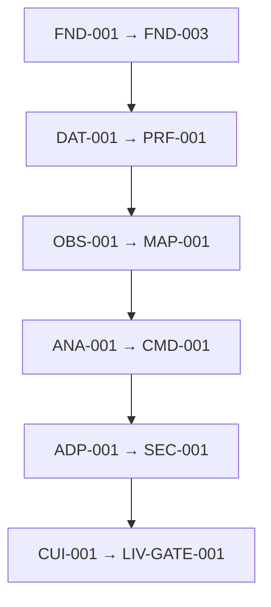

# ANEXO NORMATIVO — GRAFO DE PRECEDÊNCIA DOS INCREMENTOS

```text
DOCUMENT_TYPE=NORMATIVE_ANNEX
PARENT_AUTHORITY=DOCUMENTO_MESTRE
CAN_OVERRIDE_MASTER=NO
REQUIRED_FOR_MASTER_VALIDITY=YES
MISSION=LEA-50
STATUS=CANDIDATE_AWAITING_INDEPENDENT_REVIEW
```

| Ordem | Incremento | Depende de | Estado | Gate de entrada | Gate de saída | Liberação máxima |
|---:|---|---|---|---|---|---|
| 1 | `FND-001` | Arquitetura V1.0 | ✅ INTEGRATED | predecessor + autorização humana | `FND-001_EXIT_PASS` | `NULL_ONLY` |
| 2 | `FND-002` | FND-001 | ✅ INTEGRATED | predecessor + autorização humana | `FND-002_EXIT_PASS` | `NULL_ONLY` |
| 3 | `FND-003` | FND-002 | 🟧 CANDIDATE_NOT_AUTHORIZED | predecessor + autorização humana | `FND-003_EXIT_PASS` | `NULL_ONLY` |
| 4 | `DAT-001` | FND-003 | ⛔ BLOCKED_BY_PREDECESSOR | predecessor + autorização humana | `DAT-001_EXIT_PASS` | `NULL_ONLY` |
| 5 | `LST-001` | DAT-001 | ⛔ BLOCKED_BY_PREDECESSOR | predecessor + autorização humana | `LST-001_EXIT_PASS` | `NULL_ONLY` |
| 6 | `PRF-001` | LST-001 | ⛔ BLOCKED_BY_PREDECESSOR | predecessor + autorização humana | `PRF-001_EXIT_PASS` | `NULL_ONLY` |
| 7 | `OBS-001` | PRF-001 | ⛔ BLOCKED_BY_PREDECESSOR | predecessor + autorização humana | `OBS-001_EXIT_PASS` | `NULL_ONLY` |
| 8 | `CAP-001` | OBS-001 | ⛔ BLOCKED_BY_PREDECESSOR | predecessor + autorização humana | `CAP-001_EXIT_PASS` | `NULL_ONLY` |
| 9 | `VAL-001` | CAP-001 | ⛔ BLOCKED_BY_PREDECESSOR | predecessor + autorização humana | `VAL-001_EXIT_PASS` | `NULL_ONLY` |
| 10 | `MAP-001` | VAL-001 | ⛔ BLOCKED_BY_PREDECESSOR | predecessor + autorização humana | `MAP-001_EXIT_PASS` | `NULL_ONLY` |
| 11 | `ANA-001` | MAP-001 | ⛔ BLOCKED_BY_PREDECESSOR | predecessor + autorização humana | `ANA-001_EXIT_PASS` | `NULL_ONLY` |
| 12 | `SIG-001` | ANA-001 | ⛔ BLOCKED_BY_PREDECESSOR | predecessor + autorização humana | `SIG-001_EXIT_PASS` | `NULL_ONLY` |
| 13 | `CMD-001` | SIG-001 | ⛔ BLOCKED_BY_PREDECESSOR | predecessor + autorização humana | `CMD-001_EXIT_PASS` | `NULL_ONLY` |
| 14 | `ADP-001` | CMD-001 | ⛔ BLOCKED_BY_PREDECESSOR | predecessor + autorização humana | `ADP-001_EXIT_PASS` | `SIMULATED` |
| 15 | `EXE-001` | ADP-001 | ⛔ BLOCKED_BY_PREDECESSOR | predecessor + autorização humana | `EXE-001_EXIT_PASS` | `SIMULATED` |
| 16 | `SEC-001` | EXE-001 | ⛔ BLOCKED_BY_PREDECESSOR | predecessor + autorização humana | `SEC-001_EXIT_PASS` | `SIMULATED` |
| 17 | `CUI-001` | SEC-001 | ⛔ BLOCKED_BY_PREDECESSOR | predecessor + autorização humana | `CUI-001_EXIT_PASS` | `CONTROLLED_UI` |
| 18 | `LIV-GATE-001` | CUI-001 | ⛔ BLOCKED_BY_PREDECESSOR | predecessor + autorização humana | `LIV-GATE-001_EXIT_PASS` | `LIVE_GATED_CAPABILITY_ONLY` |



O diagrama é uma visualização resumida; a tabela acima e o catálogo são a enumeração normativa completa.

```text
DEPENDENCY_CYCLES=0
MISSING_DEPENDENCIES=0
UNKNOWN_INCREMENT_REFERENCES=0
INCREMENT_WITHOUT_ENTRY_GATE=0
INCREMENT_WITHOUT_EXIT_GATE=0
INCREMENT_WITHOUT_ROLLBACK=0
INCREMENT_WITHOUT_LOCAL_TEST=0
AMBIGUOUS_NEXT_INCREMENT=0
```
